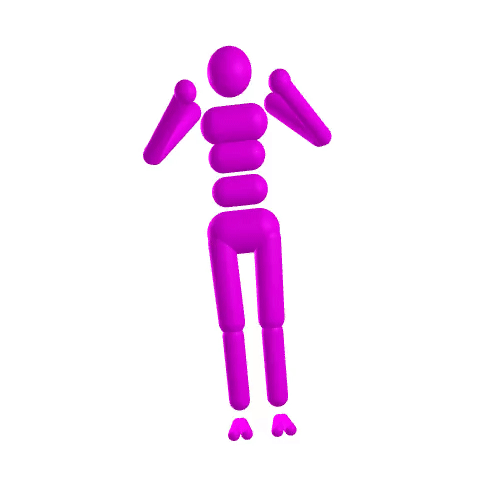
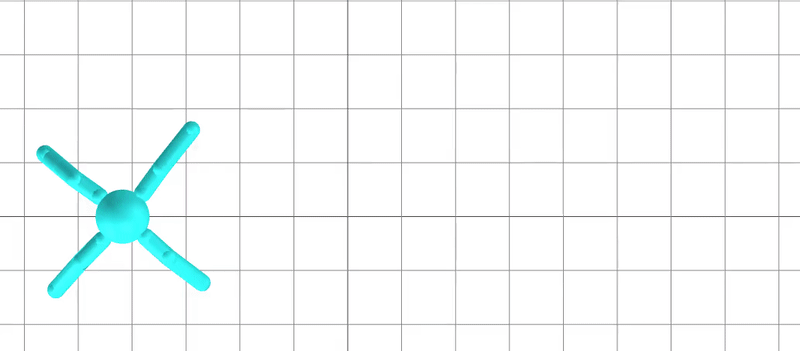
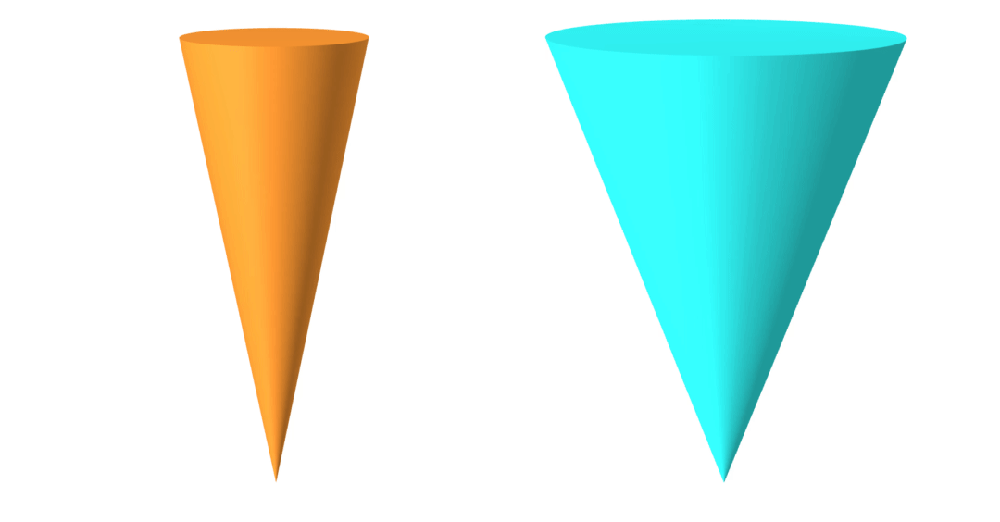
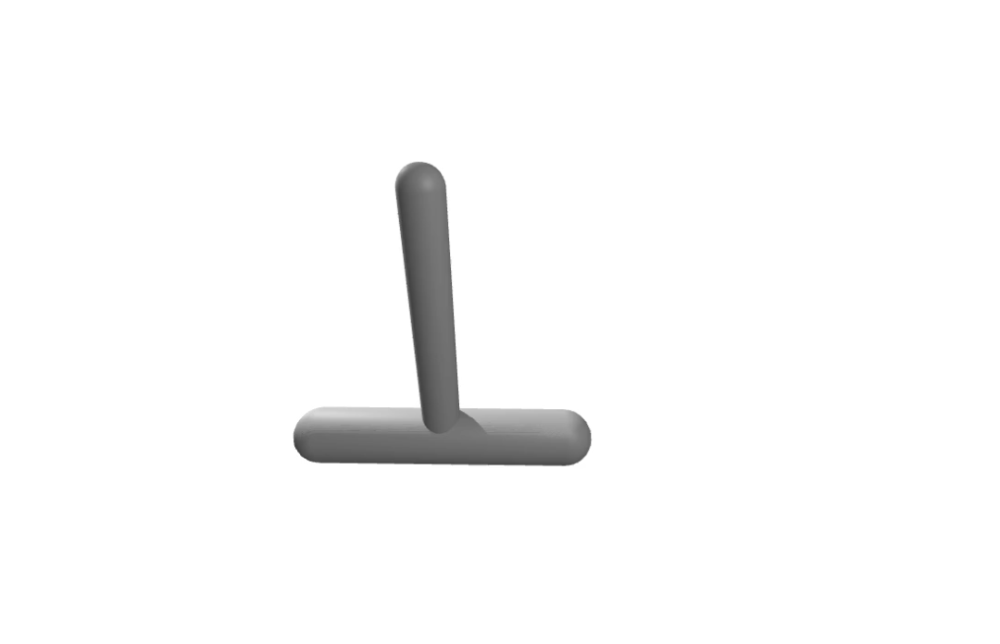

[](https://github.com/dojo-sim/Dojo.jl/actions/workflows/CI.yml)
[](https://codecov.io/gh/dojo-sim/Dojo.jl)
[](https://dojo-sim.github.io/Dojo.jl/dev)

# Dojo
A differentiable physics engine for robotics
- arXiv preprint: https://arxiv.org/abs/2203.00806
- Python interface: https://github.com/dojo-sim/dojopy
- site: https://sites.google.com/view/dojo-sim
- video presentation: https://youtu.be/TRtOESXJxJQ

[](https://youtu.be/TRtOESXJxJQ "Dojo: A Differentiable Simulator for Robotics")

# Update April 2023
- We are no longer actively developing Dojo, but pull requests are always welcome.
- We have updated or removed examples to account for changes since the initial version of Dojo.
- Additional developments on differentiable simulation:
  - Differentiable collision detection (Kevin Tracy): [capsules](https://arxiv.org/abs/2207.00202), [convex primitives](https://arxiv.org/abs/2207.00669) 
  - Single-level contact dynamics + collision detection (Simon Le Cleac'h): [Silico](https://arxiv.org/pdf/2212.06764.pdf)

# Examples

## Simulation
<p float="left">
	
	
	
	
</p>

## Learning and Control
<p float="left">
	
	
	
</p>

## System Identification
<p float="left">
	
	
	
</p>


## Interfacing Other Packages
| [ReinforcementLearning.jl](https://github.com/JuliaReinforcementLearning/ReinforcementLearning.jl): DQN | [ControlSystems.jl](https://github.com/JuliaControl/ControlSystems.jl): LQR |
| - | -|
|  |  |


## Installation

`Dojo` can be added via the Julia package manager (type `]`):
```julia
pkg> add Dojo
```
For convenience mechanisms and environments, add `DojoEnvironments` additionally:
```julia
pkg> add DojoEnvironments
```

## Citing
```
@article{howelllecleach2022,
	title={Dojo: A Differentiable Simulator for Robotics},
	author={Howell, Taylor and Le Cleac'h, Simon and Bruedigam, Jan and Kolter, Zico and Schwager, Mac and Manchester, Zachary},
	journal={arXiv preprint arXiv:2203.00806},
	url={https://arxiv.org/abs/2203.00806},
	year={2022}
}
```

## How To Contribute
Please submit a pull request or open an issue.
See the [docs](https://dojo-sim.github.io/Dojo.jl/dev/contributing.html) for contribution ideas.
