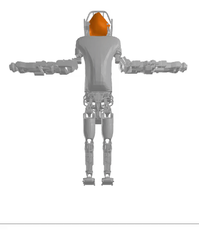
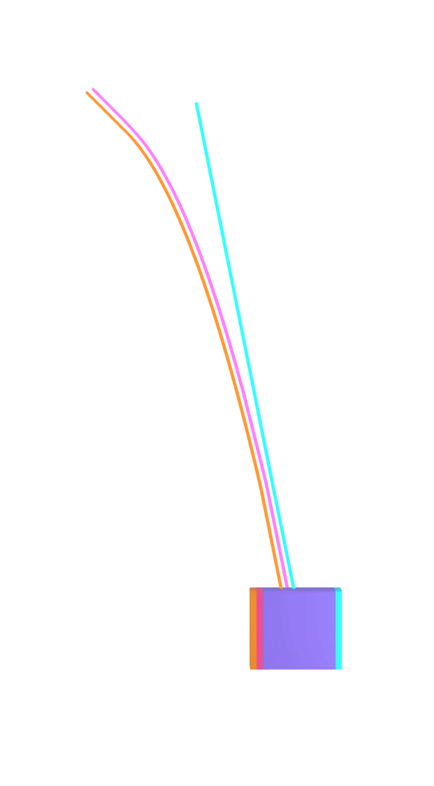
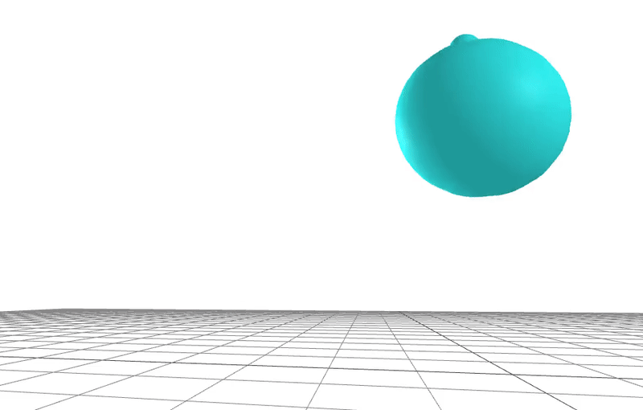
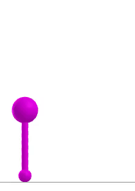
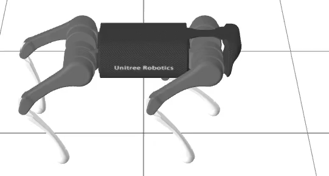
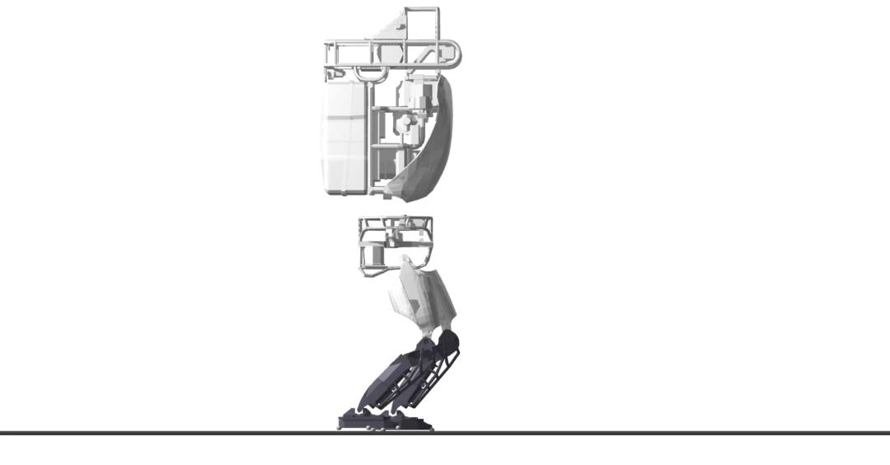
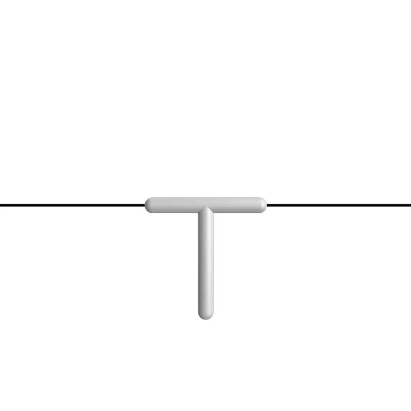
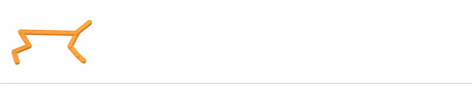
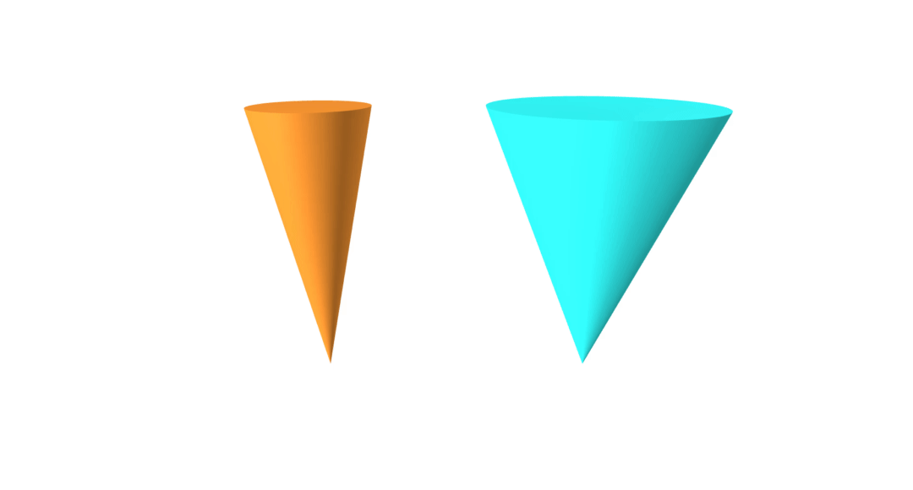

[](https://github.com/dojo-sim/Dojo.jl/actions/workflows/CI.yml)
[](https://codecov.io/gh/dojo-sim/Dojo.jl)
[](https://dojo-sim.github.io/Dojo.jl/dev)

# Dojo
A differentiable simulator for robotics
- arXiv preprint: https://arxiv.org/abs/2203.00806
- Python interface: https://github.com/dojo-sim/dojopy
- site: https://sites.google.com/view/dojo-sim
- presentation video: https://youtu.be/TRtOESXJxJQ

# Examples

## Simulation

### Atlas drop


### REx Hopper drop


### Astronaut


### Friction-cone comparison
- blue = Dojo nonlinear friction cone
- orange = Dojo linear friction cone
- black = MuJoCo nonlinear friction cone
- magenta = MuJoCo linear friction model


### Dzhanibekov effect


### Tippe top


### Pendulum swing-up


## Trajectory Optimization

### Box


### Hopper


### Quadruped


### Atlas


### Cart-pole


## Reinforcement Learning

### Half Cheetah


### Ant


## Real-To-Sim

### Learning
Learning geometry:

Learning friction coefficient:


### Toss


## Installation

`Dojo` can be added via the Julia package manager (type `]`):
```julia
pkg> add Dojo
```

The latest version can be added by calling:
```julia
pkg> add Dojo#main
```

## Citing
```
@article{howelllecleach2022,
	title={Dojo: A Differentiable Simulator for Robotics},
	author={A. Howell, Taylor and Le Cleac'h, Simon and Kolter, Zico and Schwager, Mac and Manchester, Zachary},
	journal={arXiv preprint arXiv:2203.00806},
	url={https://arxiv.org/abs/2203.00806},
	year={2022}
}
```

## How To Contribute
Please submit a pull request, open an issue, or reach out to: thowell@stanford.edu (Taylor) or simonlc@stanford.edu (Simon)
