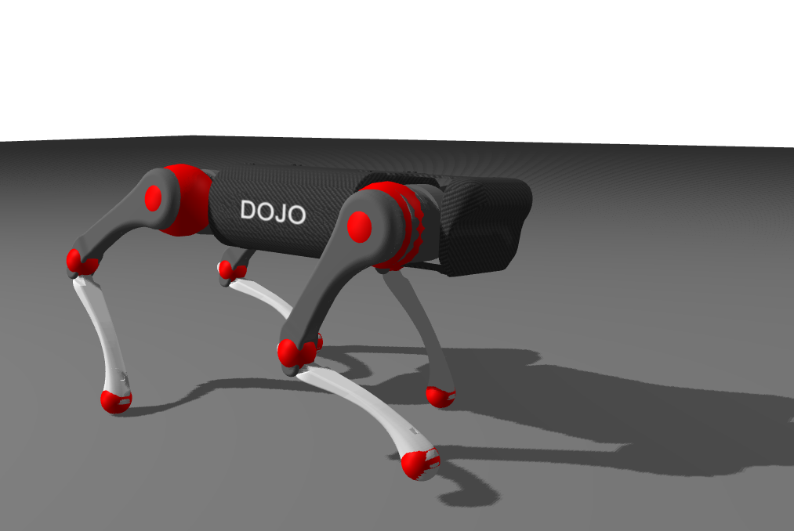

# Overview

### Models
Three contact models are implemented in Dojo:
- [`ImpactContact`](@ref) enforces frictionless contact,
- [`NonlinearContact`](@ref) enforces contact with a non-linear cone of friction (second-order cone),

- [`LinearContact`](@ref) enforces contact with a linearized cone of friction (pyramidal cone).

All 3 of these contact models implement hard contact i.e. no interpenetration. This means that for both the nonlinear and linearized cones, we concatenate the constraints resulting from friction with the impact constraints.

### Implementation
Dojo currently supports contact constraints occurring between a sphere and the ground i.e. a horizontal half-space of altitude 0.0. Each spherical contact is attached to a single [`Body`](@ref).

To create a new point of contact, we need to define:
- the [`Body`](@ref) to which the contact constraint is attached
- radius of the sphere defining the spherical contact
- coefficient of friction (except for [`ImpactContact`](@ref))

### Example
For the Quadruped model shown in the picture below, we defined 12 contacts spheres show in red:
- 4 for the feet,
- 4 for the knees,
- 4 for for the hips.

