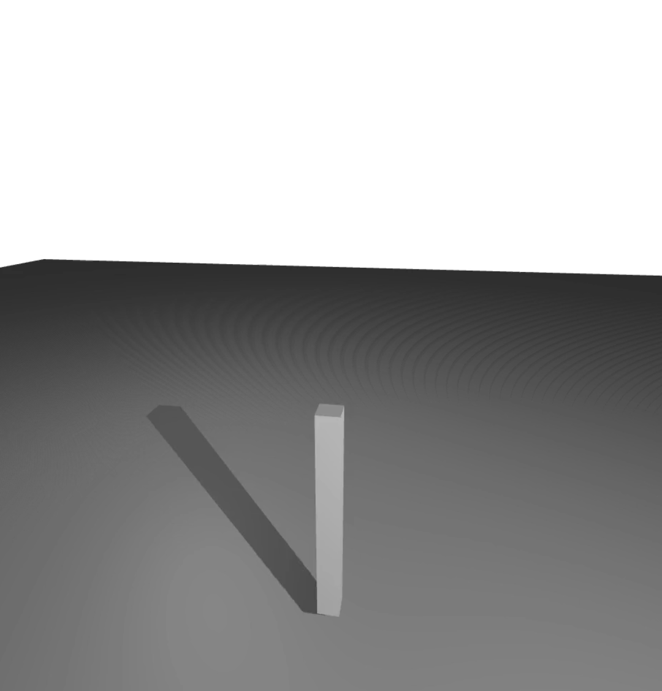

# Defining a Controller

Here, we explain how to write a controller and simulate its effect on a dynamical system, i.e., a [`Mechanism`](@ref).
We focus on a simple pendulum swing-up. The controller is a method that always takes 2 input arguments:
- a [`Mechanism`](@ref),
- an integer `t` indicating the current simulation step.
For the pendulum, the controller computes the control inputs based on the current state `x`, the goal state `x_goal` and a PID controller.

```julia
# ### Setup
using Dojo
using DojoEnvironments

# ### Mechanism
mechanism = get_mechanism(:pendulum)

# ### Controller
summed_error = 0 # for integral part

function controller!(mechanism, k)
    ## Target state
    x_goal = [π/2; 0.0]

    ## Current state
    x = get_minimal_state(mechanism)

    error = (x_goal-x)
    global summed_error += error[1]*mechanism.timestep

    ## Gains
    Kp = 25
    Ki = 50
    Kd = 5

    ## Control inputs
    u = Kp*error[1] + Ki*summed_error + Kd*error[2]
    set_input!(mechanism, [u])
end

# ### Simulate
initialize!(mechanism, :pendulum,
    angle=0.0, angular_velocity=0.0)

storage = simulate!(mechanism, 5.0, controller!, record=true)

# ### Visualize
vis = visualize(mechanism, storage)
render(vis)
```

By changing the parameters, you should be able to perform a swing up. You might need to be carful due to a possible sign-change in the top position. 
```@raw html

```
