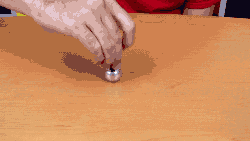

# Defining a Mechanism
Here, we describe how to define your own dynamical system of [`Mechanism`](@ref). After it has been defined, it will be extremely easy to simulate it, control it, perform trajectory optimization on it, or even policy optimization.

We're going to build a tippe top,


```@raw html

```

```@raw html

```

### Build Mechanism

To do this, we need to define two methods. The first one is named `get_...` where `...` is the name of the mechanism. So here we define `get_tippetop`. This function return a [`Mechanism`](@ref) and takes as input a variety of parameters like the simulation time step, gravity etc. You can add as many parameters you want. This example is typical of what you will find in Dojo.

To build the mechanism corresponding to the tippe top, we decompose it into two spherical bodies. Each body has its own spherical contact constraint with the floor. The joint between the two bodies is a `fixed_joint` and the joint between the main body and the [`Origin`](@ref) of the frame is a floating joint.

```julia
function get_tippetop(;
    timestep=0.01,
    gravity=[0.0; 0.0; -9.81],
    friction_coefficient=0.4,
    contact_type=:nonlinear,
    T=Float64)

    # define origin
    origin = Origin{T}(name=:origin)
    # define the two bodies which will form the tippe top once assembled
    radius = 0.5
    mass = 1.0
    α = 0.2
    bodies = [
        Sphere(radius, mass, name=:sphere1, color=gray_light),
        Sphere(radius*α, mass*α^3, name=:sphere2, color=gray_light)]
    # modify inertia of the first body to ensure we obtain the desired behavior
    bodies[1].inertia = Diagonal([1.9, 2.1, 2.0])

    # define the joints, the 1st joint is between Origin and :sphere1
    # the 2nd joint is between :sphere1 and :sphere2
    joints = [
        JointConstraint(Floating(origin, bodies[1]),
                name=:floating_joint),
        JointConstraint(Fixed(bodies[1], bodies[2],
                parent_vertex=[0,0,radius],
                child_vertex=zeros(3)),
                name = :fixed_joint)]

    # define the two spherical contacts, each contact is attached to a body.
    contact_point = [0.0, 0.0, 0.0] # both contact spheres are located at the center of the bodies they are attached to.
    normal = [0.0, 0.0, 1.0] # the normal of the contact is always pointing in the upright direction because the floor is flat.
    # we specify the type of contact (impact, linear, nonlinear), the coefficient of friction, the radius of the contact sphere, etc.
    contacts = [
        contact_constraint(get_body(mechanism, :sphere1), normal,
            friction_coefficient=friction_coefficient,
            contact_point=contact_point, offset=[0.0, 0.0, radius],
            contact_type=contact_type),
        contact_constraint(get_body(mechanism, :sphere2), normal,
            friction_coefficient=friction_coefficient,
            contact_point=contact_point,
            offset=[0.0, 0.0, radius * α],
            contact_type=contact_type)
        ]

    # we build the mechanism by combining together the the origin, the bodies, the joints, and the contacts.
    mechanism = Mechanism(origin, bodies, joints, contacts,
        gravity=gravity,
        timestep=timestep)

    # we make sure that the mechanism is never initialized with its contact spheres below the ground.
    set_minimal_coordinates!(mechanism, get_joint(mechanism, :floating_joint), [0.0; 0.0; radius; zeros(3)])
    return mechanism
end
```

### Initialize Mechanism
The second method that we need to define is `initialize_...` where `...` is the name of the mechanism. So here we define `initialize_tippetop`. This function initialize the dynamical system to a certain state. This means that we set the position orientation, linear and angular velocity of each body in the mechanism.


```julia
function initialize_tippetop!(mechanism::Mechanism{T};
    x=zeros(3),
    θ=zeros(3),
    v=zeros(3),
    ω=zeros(3)) where T

    # we retrieve the joints from the mechanism by their names
    floating_joint = get_joint(mechanism, :floating_joint)
    fixed_joint = get_joint(mechanism, :fixed_joint)
    radius = fixed_joint.translational.vertices[1][3]

    # we set all the bodies' velocities to zeros
    zero_velocity!(mechanism)
    # we set to minimal coordinates of the floating joint
    set_minimal_coordinates_velocities!(mechanism, floating_joint, xmin=[x; θ; v; ω])
    # we set to minimal coordinates of the fixed joint (this joint has zero minimal coordinate).
    set_minimal_coordinates_velocities!(mechanism, fixed_joint)
    return nothing
end
```
