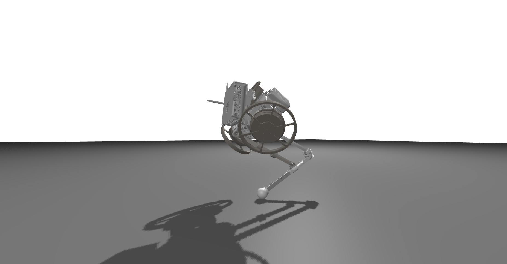

# Loading Mechanism via URDF
Another way to build a mechanism is to directly load it from a URDF file. We illustrate this with the RExLab hopper.

```julia
function get_rexhopper(;
    timestep=0.01,
    gravity=[0.0; 0.0; -9.81],
    friction_coefficient=1.0,
    contact_body=true,
    limits=true,
    model=:rexhopper,
    floating=true,
    contact_type=:nonlinear,
    spring=0.0,
    damper=1.0,
    T=Float64)

    # we define the path of the URDF file
    path = joinpath(@__DIR__, "../deps/$(String(model)).urdf")
    # we load the URDF file into a Mechanism object
    mech = Mechanism(path, floating, T,
        gravity=gravity,
        timestep=timestep,
        spring=spring,
        damper=damper)
    return mech
end
```
Here, we have created a mechanism, that contains all the bodies and the joint and also the meshes loaded from the path contained in the URDF file. This is the resulting robot;


However, we are still missing the joint limits and the contact spheres. The following methods provides an example for adding joint limits and contact spheres. Our goal here was to best approximate the mesh shapes using as few spheres as possible.
Parsing joint limits from the URDF to add them automatically to the mechanism should be easily feasible. That could be a great way to contribute and familiarize yourself with the code!

```julia
function get_rexhopper(;
    timestep=0.01,
    gravity=[0.0; 0.0; -9.81],
    friction_coefficient=1.0,
    contact_body=true,
    limits=true,
    model=:rexhopper,
    floating=true,
    contact_type=:nonlinear,
    spring=0.0,
    damper=1.0,
    T=Float64)

    # we define the path of the URDF file
    path = joinpath(@__DIR__, "../deps/$(String(model)).urdf")
    # we load the URDF file into a Mechanism object
    mech = Mechanism(path, floating, T,
        gravity=gravity,
        timestep=timestep,
        spring=spring,
        damper=damper)

    # we add joint limits to the mechanism
    joints = deepcopy(mech.joints)
    if limits
        joint1 = get_joint(mech, :joint1)
        joint3 = get_joint(mech, :joint3)
        joints[joint1.id] = add_limits(mech, joint1,
            rot_limits=[SVector{1}(-0.7597), SVector{1}(1.8295)])
        joints[joint3.id] = add_limits(mech, joint3,
            rot_limits=[SVector{1}(-1.8295), SVector{1}(0.7597)])
        mech = Mechanism(Origin{T}(), [mech.bodies...], [joints...],
            gravity=gravity,
            timestep=timestep,
            spring=spring,
            damper=damper)
    end

    # we attach spherical collisions zones to certain bodies
    if contact_body
        origin = Origin{T}()
        bodies = mech.bodies
        joints = mech.joints

        normal = [0.0; 0.0; 1.0]
        contacts = []

        link3 = get_body(mech, :link3)
        link2 = get_body(mech, :link2)
        foot_radius = 0.0203
        ankle_radius = 0.025
        base_radius = 0.125
        p = [0.1685; 0.0025; -0.0055]
        o = [0;0; foot_radius]
        push!(contacts, contact_constraint(link3, normal,
            friction_coefficient=friction_coefficient,
            contact_point=p,
            offset=o,
            contact_type=contact_type,
            name=:foot))
        p = [-0.10; -0.002; 0.01]
        o = [0;0; ankle_radius]
        push!(contacts, contact_constraint(link3, normal,
            friction_coefficient=friction_coefficient,
            contact_point=p,
            offset=o,
            contact_type=contact_type,
            name=:ankle3))
        p = [0.24; 0.007; 0.005]
        push!(contacts, contact_constraint(link2, normal,
            friction_coefficient=friction_coefficient,
            contact_point=p,
            offset=o,
            contact_type=contact_type,
            name=:ankle2))
        base_link = get_body(mech, :base_link)
        p = [0.0; 0.0; 0.0]
        o = [0;0; base_radius]
        push!(contacts, contact_constraint(base_link, normal,
            friction_coefficient=friction_coefficient,
            contact_point=p,
            offset=o,
            contact_type=contact_type,
            name=:torso))

        set_minimal_coordinates!(mech, get_joint(mech, :floating_base), [0,0,1.0, 0,0,0])
        mech = Mechanism(origin, bodies, joints, [contacts...],
            gravity=gravity,
            timestep=timestep,
            spring=spring,
            damper=damper)
    end
    return mech
end
```

This is the result, we added three spherical contacts to the robot. There is one coverinn the torso one covering the knee and one covering the foot, they are shown in red;

